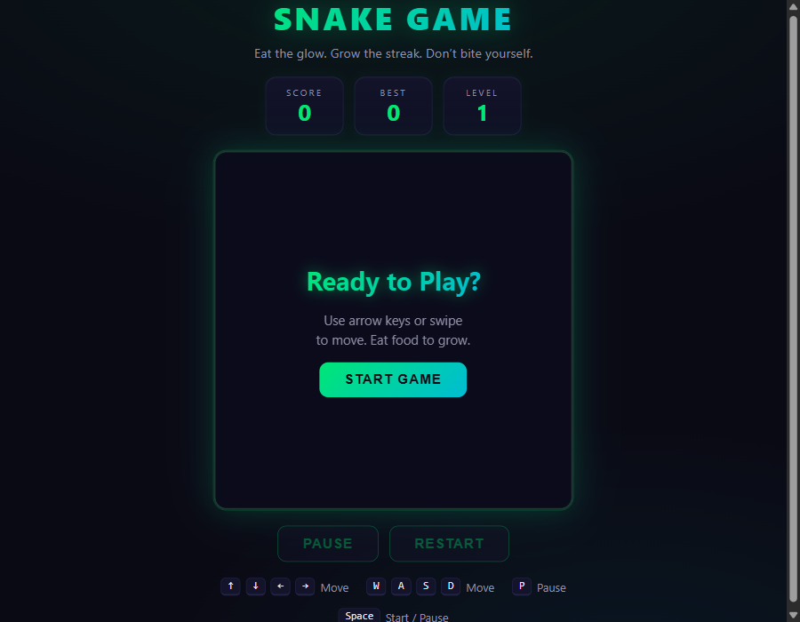
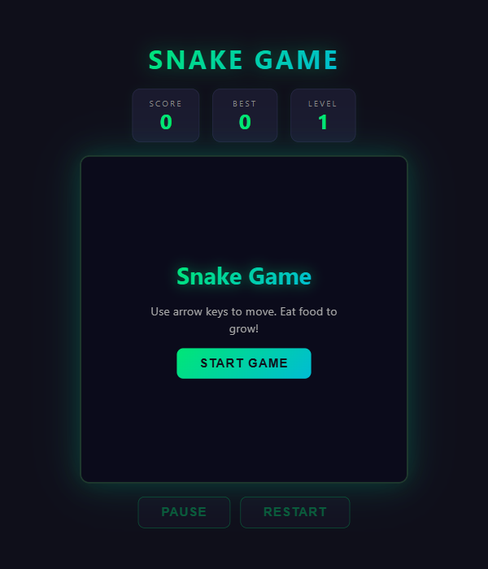
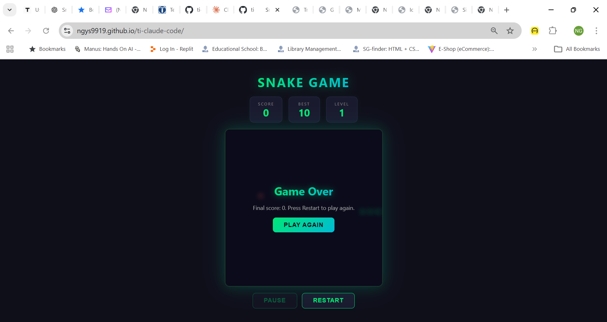

# Snake Game

A modern, responsive Snake Game built with vanilla **HTML, CSS, and JavaScript** — no frameworks, no build step, no dependencies.

**Live demo:** https://ngys9919.github.io/ti-claude-code/





## Features

- Classic snake-and-food gameplay on a 20×20 grid
- Smooth canvas rendering with neon glow styling
- Current score, best score (persisted via `localStorage`), and level indicator
- Progressive difficulty — speed increases every 50 points
- Pause / Resume and Restart controls
- Game Over overlay with final score
- Multi-input support:
  - **Keyboard**: Arrow keys or `W` `A` `S` `D`
  - **Pause**: `P` or `Space`
  - **Mobile**: on-screen directional buttons and swipe gestures on the canvas



## Getting Started

No install, no build. Just open the game in a browser.

### Option 1 — Open directly

Double-click [index.html](index.html) or drag it into any modern browser.

### Option 2 — Serve locally

Any static server works. For example, with Python:

```bash
python -m http.server 8000
```

Then visit http://localhost:8000.

## Project Structure

```
index.html   — markup, scoreboard, canvas, overlay, controls
style.css    — dark neon theme, responsive layout, mobile touch UI
script.js    — all game logic (state machine, game loop, input, rendering)
```

## How It Works

- **Grid model**: positions are stored as `{x, y}` cell coordinates; the renderer multiplies by `CELL` size when drawing.
- **Game loop**: `setInterval` drives ticks; the interval is recomputed from `level` each time the level changes.
- **Input buffering**: key presses update `nextDirection`, which the loop copies into `direction` on each tick — this prevents accidental self-reversal from rapid key presses.
- **State machine**: `idle → running ⇄ paused → over`, with transitions centralised in `startGame` / `pauseGame` / `endGame`.
- **Persistence**: high score is saved in `localStorage` under the key `snakeHighScore`.

## Deployment

Automatically deployed to **GitHub Pages** on every push to `main` via [.github/workflows/deploy.yml](.github/workflows/deploy.yml).

To enable it on a fork:

1. Go to **Settings → Pages**
2. Set **Source** to **GitHub Actions**
3. Push to `main` — the workflow publishes the repo root as the Pages site.

## License

Feel free to play, fork, and modify.
